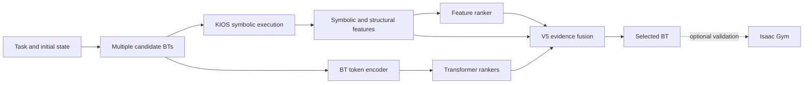

# Simulation-Aware Multi-Candidate Behavior Tree Selection

This repository contains the implementation and experimental artefacts for an MSc dissertation on reliable behavior-tree (BT) selection for robotic task planning. It investigates whether generating several candidate BTs and selecting among them is more reliable than directly executing one generated BT.

## 1. Project Overview

LLMs and template-based planners can produce behavior trees from task instructions, but a syntactically valid BT is not necessarily executable, physically stable, or efficient. This project therefore separates BT generation from BT selection.

For each task and initial world state, the system:

1. obtains multiple candidate BTs from templates or an LLM;
2. executes each candidate symbolically in KIOS;
3. extracts symbolic, structural, learned, and optional simulation evidence;
4. ranks the candidates with baseline selectors and the proposed V5 selector; and
5. returns one BT for execution and optional Isaac Gym validation.

The principal contribution is a simulation-grounded selection framework combining interpretable symbolic and physical evidence with feature and Transformer rankers. Oracle information defines supervision and evaluation upper bounds only; it is not an input to the deployed selector.

### External resources and original contribution

This project extends the existing [KIOS codebase](https://github.com/ProNeverFake/kios) and uses NVIDIA Isaac Gym, the LL4MA Isaac Gym integration, PyTorch, `py_trees`, scikit-learn, and the OpenAI API. These systems provide the symbolic-execution, simulation, machine-learning, and language-model infrastructure.

The original work in this repository comprises the multi-candidate BT benchmark, candidate perturbation families, simulation-job generation, feature and Transformer ranking models, manual and learned V5 selectors, strict group- and source-aware evaluation, ablation and bootstrap analyses, GPT multi-candidate integration, and the browser demonstration. The repository is maintained as a private academic submission unless public release is expressly permitted by the relevant module lead.

## 2. Method



The implementation separates two workflows:

- **Offline training:** simulation-labelled candidates are converted into task-grouped ranking examples. Feature-only, Transformer-only, and fused rankers are trained before fitting and evaluating learned V5.
- **Online inference:** a new candidate set is evaluated by KIOS, encoded with saved models, and ranked by V5. Isaac Gym is optional, supporting both pre-execution selection and simulate-then-select evaluation.

| Selector | Evidence used | Role |
| --- | --- | --- |
| `shortest_tree` | BT size | Structural baseline |
| `symbolic_only` | KIOS execution features | Symbolic baseline |
| `feature_only` | Engineered task, BT, and execution features | Learned baseline |
| `transformer_only` | Preorder BT token sequence | Structural learned baseline |
| `transformer_fused` | BT tokens and tabular features | Multimodal learned baseline |
| `manual_v5` | Fixed weighted evidence fusion | Interpretable ensemble baseline |
| `v5_learned_full` | Learned component scores and reliability evidence | Proposed final selector |
| `oracle` | Ground-truth evaluation score | Evaluation upper bound only |

## 3. Repository Structure

| Path | Purpose |
| --- | --- |
| `kios_bt_planning/` | KIOS BT-planning package and symbolic execution interfaces |
| `experiments/bt_selection_benchmark/` | Benchmark construction, evaluation, training, and analysis |
| `experiments/bt_selection_benchmark/bt_candidates/` | Candidate BT JSON files |
| `experiments/bt_selection_benchmark/models/` | Dataset builders, rankers, V5 training, and audit scripts |
| `experiments/bt_selection_benchmark/results/` | Candidate results, selector summaries, reports, tables, and figures |
| `experiments/bt_selection_benchmark/simulation_jobs*/` | Isaac Gym job configurations and manifests |
| `experiments/gpt_candidate_demo/` | End-to-end single- and multi-candidate GPT demonstrations |
| `experiments/gpt_candidate_demo/models/online_v5/` | Saved online rankers and V5 metadata |
| `experiments/gpt_candidate_demo/frontend/` | Browser interface and generated demonstration data |
| `experiments/gpt_candidate_demo/results/` | GPT pilot and online selector outputs |
| `config/` | KIOS and BT configuration files |
| `docs/` | Supporting project documentation |

Large Isaac Gym rollouts are stored outside Git under a configurable dataset root. Generated results remain in `experiments/**/results/`, allowing analysis without rerunning every simulation.

## 4. Installation

### Validated environment

| Component | Validated configuration |
| --- | --- |
| Operating system | Ubuntu 20.04 under WSL2 |
| Python | 3.8.10 |
| PyTorch | 2.4.1 with CUDA 12.1 support |
| Robotics middleware | ROS Noetic and MoveIt services used by LL4MA |
| Simulation | NVIDIA Isaac Gym with LL4MA integration |
| Browser demo | Current Chromium- or Firefox-based browser |

The ranking and reporting pipeline can run on CPU. A CUDA-capable GPU is optional for training. Isaac Gym GUI replay additionally requires a working display and Vulkan configuration.

Create an isolated Python environment from the repository root:

```bash
python3.8 -m venv .venv
source .venv/bin/activate
python -m pip install --upgrade pip
pip install -r requirements.txt
pip install pandas scipy scikit-learn matplotlib
pip install -e kios_bt_planning
```

Install a PyTorch build compatible with the local CUDA runtime. The reported experiments used `2.4.1+cu121`. Verify it with:

```bash
python -c "import torch; print(torch.__version__); print(torch.cuda.is_available())"
```

Isaac Gym, ROS Noetic, MoveIt, and LL4MA are external dependencies and must be installed separately. Before simulation, the ROS master and required MoveIt planning service must be available.

## 5. Data and Models

The final benchmark contains 660 candidate BTs across 110 task-state groups. Candidates from one group remain in the same partition.

| Partition | Benchmarks | Groups | Candidates | Purpose |
| --- | --- | ---: | ---: | --- |
| Development | V1, V2, V2B | 80 | 480 | Training and model development |
| Held-out hard cases | V6 | 30 | 180 | Hard-case distribution-shift evaluation |
| Total | V1-V6 | 110 | 660 | Descriptive reporting |

V6 uses harder states and candidate strategies derived from related manipulation templates. It is therefore a hard-case distribution shift, not completely unseen-task generalisation.

The consolidated training table is:

```text
experiments/bt_selection_benchmark/results/learned_selector_dataset_v3a.csv
```

Its source evaluations are:

```text
experiments/bt_selection_benchmark/results/bt_candidate_evaluations_v1_supported_by_with_sim.csv
experiments/bt_selection_benchmark/results/bt_candidate_evaluations_v2_stacking_probe_with_sim.csv
experiments/bt_selection_benchmark/results/bt_candidate_evaluations_v2b_physical_strategy_with_sim.csv
experiments/bt_selection_benchmark/results/bt_candidate_evaluations_v6_hard_cases_with_sim.csv
```

Saved online models are:

```text
experiments/gpt_candidate_demo/models/online_v5/feature_only.pkl
experiments/gpt_candidate_demo/models/online_v5/transformer_only.pt
experiments/gpt_candidate_demo/models/online_v5/transformer_fused.pt
experiments/gpt_candidate_demo/models/online_v5/metadata.json
```

Vocabulary, normalisation, and model parameters are fitted on the training partition for held-out evaluation. `true_score` and Oracle choices are used for training targets or final evaluation only.

### Data availability

The repository includes the 87 canonical CSV files used for the reported benchmark, selector, ablation, strict-holdout, and GPT-pilot analyses. Large Isaac Gym pickle files, generated simulation-job directories, raw per-call GPT outputs, and runtime logs are intentionally excluded. They are intermediate artefacts rather than the authoritative reporting tables and can be regenerated with the scripts in Section 7. No API keys or machine-specific environment files are included.

## 6. Quick Start

This path uses existing candidates and saved rankers. It does not call the OpenAI API or launch Isaac Gym.

```bash
cd /path/to/kios_baseline
source .venv/bin/activate

OMP_NUM_THREADS=4 MKL_NUM_THREADS=4 \
python3 experiments/gpt_candidate_demo/run_gpt_candidate_demo.py \
  --generator existing \
  --candidate-count 4
```

The command prints the selected candidate and writes ranking and visualisation data to:

```text
experiments/gpt_candidate_demo/results/
experiments/gpt_candidate_demo/frontend/demo_data.json
```

Saved-model inference normally completes in tens of seconds on the validated WSL CPU environment; simulation time is not included.

To inspect the browser demonstration:

```bash
cd experiments/gpt_candidate_demo/frontend
python3 -m http.server 8091
```

Open `http://localhost:8091/`. The page presents the task, candidate ranking, selected BT, V5 score decomposition, placement view, and simulation commands.

## 7. Reproducing Experiments

Run the following commands from the repository root.

### 7.1 Build the dataset

```bash
python3 experiments/bt_selection_benchmark/models/build_learned_selector_dataset.py
```

Expected output: 660 candidate rows across 110 task-state groups.

### 7.2 Train and evaluate component selectors

```bash
bash experiments/bt_selection_benchmark/summarize_v3a_feature_selector.sh
bash experiments/bt_selection_benchmark/summarize_v3b_pairwise_selector.sh
bash experiments/bt_selection_benchmark/summarize_v4a_bt_token_selector.sh
OMP_NUM_THREADS=4 MKL_NUM_THREADS=4 \
bash experiments/bt_selection_benchmark/summarize_v4b_transformer_selector.sh
```

These stages evaluate engineered-feature, pairwise, token-based, and Transformer selectors using comparisons within each task-state group.

### 7.3 Reproduce manual and learned V5

```bash
python3 experiments/bt_selection_benchmark/models/summarize_v5_ensemble_selector.py
bash experiments/bt_selection_benchmark/summarize_v5_learned_ensemble.sh
```

The learned V5 script reports cross-validation, external V6 evaluation, and component ablations, including the no-simulation variant.

### 7.4 Audit held-out evaluation

```bash
python3 experiments/bt_selection_benchmark/models/audit_v6_strict_holdout.py
```

This checks group separation and distinguishes descriptive full-data results from held-out V6 results.

### 7.5 Regenerate figures

```bash
bash experiments/bt_selection_benchmark/plot_final_results.sh
bash experiments/bt_selection_benchmark/plot_final_results_enhanced.sh
```

Outputs are written to `experiments/bt_selection_benchmark/results/final_visualizations/`.

### 7.6 Optional GPT experiment

LLM generation requires the OpenAI package and an API key supplied through `OPENAI_API_KEY`:

```bash
python3 experiments/gpt_candidate_demo/run_gpt_candidate_demo.py \
  --generator openai \
  --model gpt-5.4-mini \
  --candidate-count 4
```

The single-BT versus four-BT pilot is launched with:

```bash
bash experiments/gpt_candidate_demo/run_single_vs_multi_gpt_baseline.sh
```

API limits and malformed responses must be reported as generation failures rather than removed from the planned-call denominator. Isaac Gym validation is optional because the benchmark CSV files already contain the simulation labels used for the reported experiments.

## 8. Results

### Strict held-out V6 hard-case evaluation

The final external evaluation fits all preprocessing and learned models on the 80 V1-V2B development groups and evaluates them on 30 V6 hard-case groups. Higher success, selected true score, pairwise accuracy, and ROC-AUC are better; lower regret is better.

| Selector | Operating mode | Success | Mean selected true score | Mean regret | Pairwise accuracy | ROC-AUC |
| --- | --- | ---: | ---: | ---: | ---: | ---: |
| `feature_only` | Pre-simulation | 40.0% | 93.167 | 3.219 | - | - |
| `transformer_only` | Pre-simulation | 36.7% | 89.809 | 6.576 | - | - |
| `transformer_fused` | Pre-simulation | 40.0% | 93.138 | 3.248 | - | - |
| `symbolic_only` | Pre-simulation | 33.3% | 86.435 | 9.951 | - | - |
| `shortest_tree` | Pre-simulation | 33.3% | 86.435 | 9.951 | - | - |
| `v5_strict_no_simulation` | Pre-simulation | 40.0% | 93.112 | 3.274 | 62.4% | 0.704 |
| `manual_v5` | Post-simulation | 40.0% | 93.204 | 3.182 | - | - |
| `v5_strict_simulation_reranker` | Post-simulation | **43.3%** | **96.352** | **0.034** | **90.7%** | **0.942** |
| `oracle` | Evaluation upper bound | 43.3% | 96.386 | 0.000 | - | - |

Before candidate-specific simulation is available, strict V5 is comparable to the strong feature-only baseline and does not establish a pre-simulation advantage. After candidate rollouts become available, learned V5 acts as a simulation-aware reranker: it matches the Oracle success count and reduces mean regret to `0.034`. The remaining gap is therefore dominated by candidate availability rather than top-1 selection.

The strict ablation supports this interpretation. Removing simulation reliability increases regret from `0.034` to `3.274`; removing Transformer votes increases it to `0.147`; and removing the aggregate symbolic-reliability term leaves top-1 regret unchanged on this split. The Transformer is consequently interpreted as complementary structural evidence rather than the sole source of performance.

Across all 110 groups, 56 contain at least one simulation-successful candidate and learned post-simulation V5 selects a successful BT in all 56. This conditional selection result does not imply that the framework solves groups for which candidate generation supplies no successful tree.

### GPT single- versus multi-candidate pilot

| Mode | Planned | Completed | Candidates | Symbolic success | Sim-labelled candidates |
| --- | ---: | ---: | ---: | ---: | ---: |
| Single BT | 30 | 29 | 29 | 27/30 | 4 |
| Four BTs plus selection | 30 | 30 | 120 | 28/30 | 10 |

This pilot demonstrates the complete language-to-BT-to-selection workflow. API limits, schema failures, and incomplete physical coverage make it an end-to-end feasibility study rather than the primary quantitative comparison.

Main reports and authoritative result tables:

```text
experiments/bt_selection_benchmark/results/v6_strict_holdout_audit.md
experiments/bt_selection_benchmark/results/v6_strict_holdout_summary.csv
experiments/bt_selection_benchmark/results/v6_strict_holdout_choices.csv
experiments/bt_selection_benchmark/results/v5_learned_ensemble_report.md
experiments/bt_selection_benchmark/results/final_visualizations/final_results_report.md
experiments/bt_selection_benchmark/results/final_visualizations/enhanced_visualization_report.md
experiments/gpt_candidate_demo/results/single_vs_multi_gpt_baseline_report.md
```
