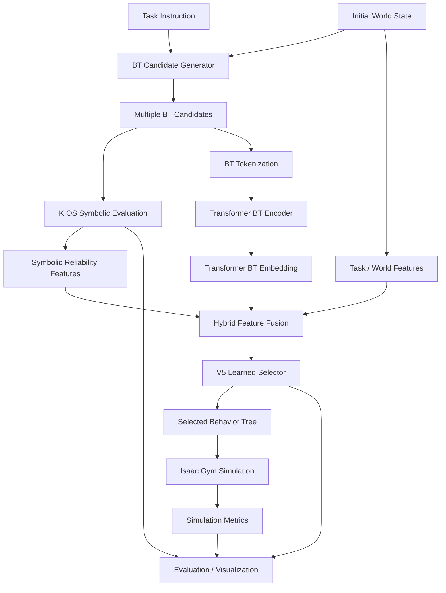
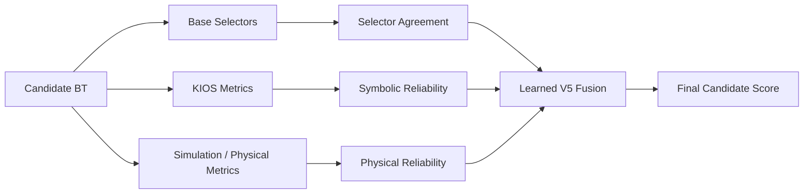
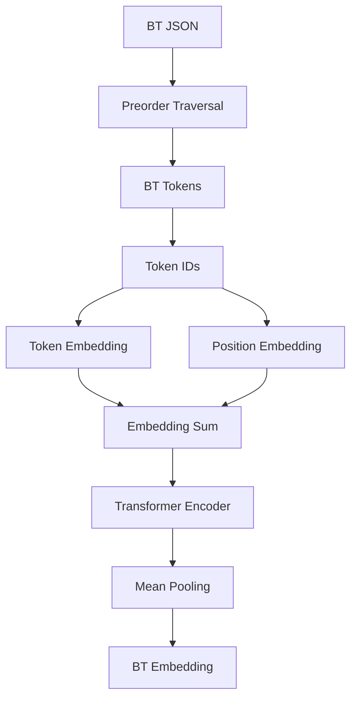

# 系统架构图 Mermaid 源码

## Overall System Architecture

```mermaid
flowchart TD
    A["Task Instruction"] --> C["BT Candidate Generator"]
    B["Initial World State"] --> C
    C --> D["Multiple BT Candidates"]

    D --> E["KIOS Symbolic Evaluation"]
    D --> F["BT Tokenization"]

    F --> G["Transformer BT Encoder"]
    E --> H["Symbolic Reliability Features"]
    B --> I["Task / World Features"]

    G --> J["Transformer BT Embedding"]
    H --> K["Hybrid Feature Fusion"]
    I --> K
    J --> K

    K --> L["V5 Learned Selector"]
    L --> M["Selected Behavior Tree"]

    M --> N["Isaac Gym Simulation"]
    N --> O["Simulation Metrics"]
    O --> P["Evaluation / Visualization"]

    E --> P
    L --> P
```

## V5 Selector Architecture

```mermaid
flowchart LR
    A["Candidate BT"] --> B["Base Selectors"]
    A --> C["KIOS Metrics"]
    A --> D["Simulation / Physical Metrics"]

    B --> E["Selector Agreement"]
    C --> F["Symbolic Reliability"]
    D --> G["Physical Reliability"]

    E --> H["Learned V5 Fusion"]
    F --> H
    G --> H

    H --> I["Final Candidate Score"]
```

## Transformer BT Encoder

```mermaid
flowchart TD
    A["BT JSON"] --> B["Preorder Traversal"]
    B --> C["BT Tokens"]
    C --> D["Token IDs"]
    D --> E["Token Embedding"]
    D --> F["Position Embedding"]
    E --> G["Embedding Sum"]
    F --> G
    G --> H["Transformer Encoder"]
    H --> I["Mean Pooling"]
    I --> J["BT Embedding"]
```

